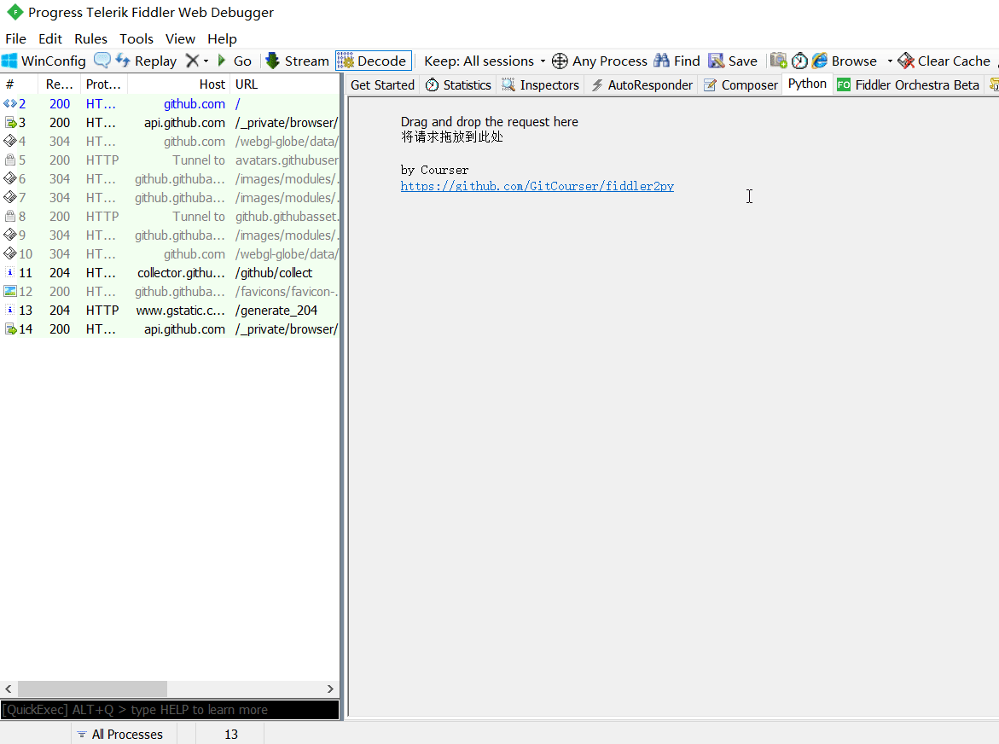

# fiddler2py
将 [Fiddler](https://www.telerik.com/fiddler/fiddler-classic) 的抓包请求转换为 Python 代码，需5.0以上版本。

# usage
将 `ToPython.cs` 编译成 dll，或者直接 [下载](https://github.com/GitCourser/fiddler2py/releases) 已经编译好的 dll 文件，然后将 dll 文件放到 `%USERPROFILE%\Documents\Fiddler2\Scripts` 或 `Fiddler安装目录\Scripts` 文件夹中，重启 Fiddler 即可

# example
